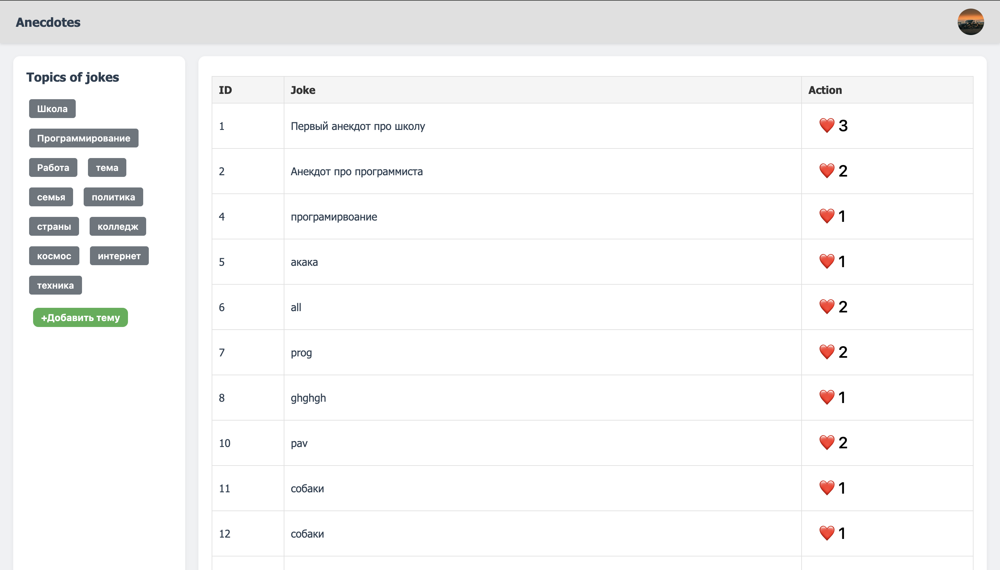
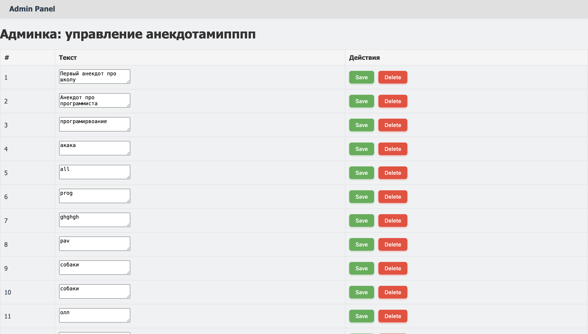
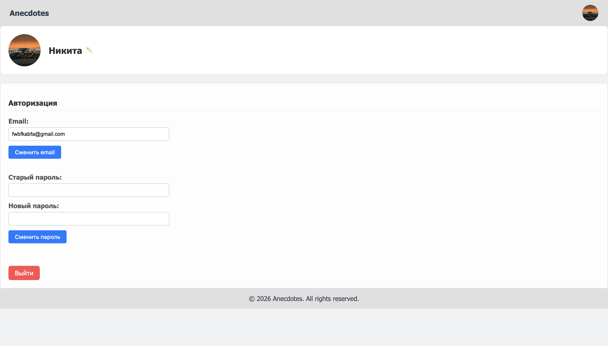

# MySite

A full-featured web application for managing and viewing anecdotes.

## 🚀 Features

- User authentication (login & registration)
- CRUD operations for anecdotes
- Voting system (like/dislike)
- REST API for frontend interaction
- Profile management

## 🛠 Tech Stack

- PHP (Symfony)
- PostgreSQL
- Docker (PHP-FPM + Nginx)
- Redis (caching, pub/sub - in progress)
- JavaScript (AJAX)

## 🧠 What I learned

- Building REST APIs with Symfony
- Working with Doctrine ORM and database relations
- Authentication & security (sessions, roles)
- Docker environment setup
- Clean architecture and service layer separation

## 🚀 Run with Docker

```bash
git clone https://github.com/NikitaBurmak/mysite
cd mysite
docker-compose up --build

## Screenshots

### Main Page


### Admin Panel


### Profile Page


